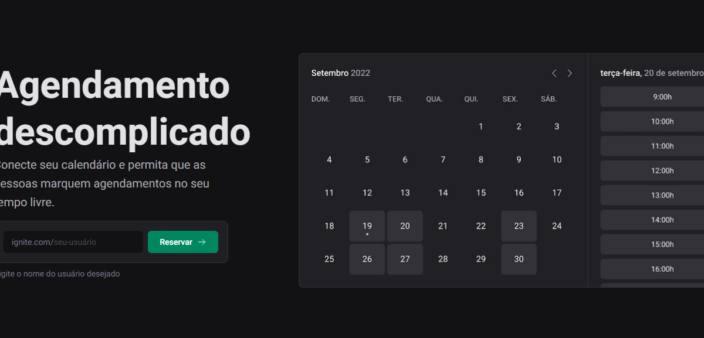
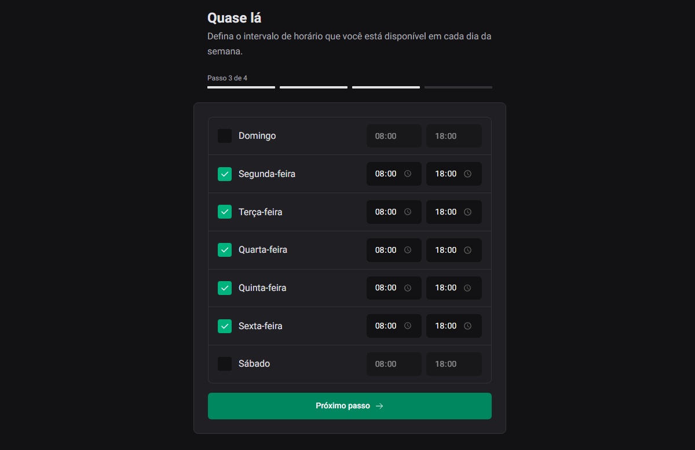
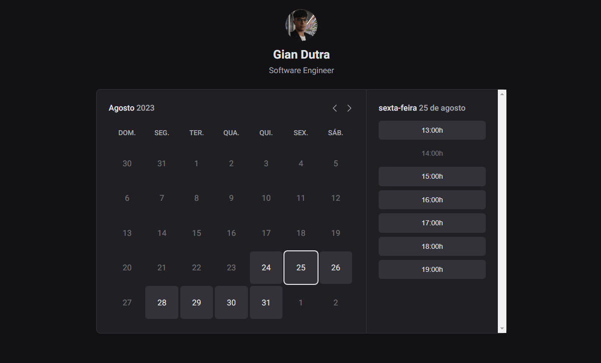

# Ignite Call (Full-stack Responsive Website)

  

  

   
  
 
  

> Project developed during the ReactJS Ignite Course from Rocketseat.

## Tech Stack

To create the website, the following was used:

#### **Website**  ([NextJS](https://nextjs.org/)  +  [React](https://reactjs.org/)  +  [TypeScript](https://www.typescriptlang.org/))
- **[PhosphorIcons](https://phosphoricons.com/)**
- **[Prisma](https://www.prisma.io/)**
- **[MySQL](https://www.mysql.com/)**
- **[React Query](https://react-query.tanstack.com/)**
- **[NextAuth](https://next-auth.js.org/)**
- **[Stitches](https://stitches.dev/)**
- **[Day.js](https://day.js.org/)**
- **[Axios](https://www.axios.com/)**
- **[Nookies](https://npm.io/package/nookies)**
- **[Zod](https://github.com/colinhacks/zod)**
- **[NextSEO](https://www.npmjs.com/package/next-seo)**

  
#### **API**
- **[Google API](https://developers.google.com/api-client-library)**

## To-do list

- [x] Generate a cookie with the user's name
- [x] Create the database in Prisma and convert it to MySQL
- [x] Handle the date difference between TypeScript and MySQL
- [x] Deploy the website on Vercel and the MySQL on PlanetScale
- [x] Create responsive mode for mobile devices
- [x] Use Google API to load profile pictures and user data within the application
- [x] Book a meeting on google calendar and create a google meet

## How to use the website:
Step 1 - Go to the website (here's the [link you'll provide]), choose a username, and click on "Reserve."

Step 2 - After that, you need to confirm the username and provide your real name (which will be displayed to others).

Step 3 - Following that, you must connect to a Google account and grant access to your Google Calendar.

Step 4 - In the fourth and final step, you should select the time slots when you'll be available for scheduling appointments.

Step 5 - Finally, you can copy the generated link with your calendar and share it with anyone you want to schedule meetings with. (The timing will be adjusted according to your Google Calendar's time zone.)

## 👨‍💼 Author

<table>
  <tr>
    <td align="center">
      <a href="#">
         
        
          <b>Gian Dutra</b>
        
      </a>
    </td>
  </tr>
</table>
